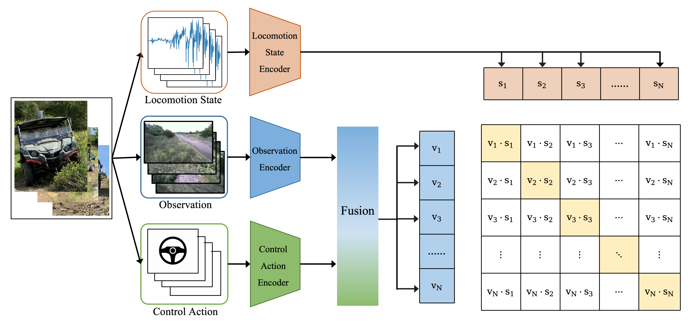

<div align="center"> 

# CLIP4OR: multi-modal self-supervised learning for off-road autonomous driving
</div>


# Method



# Requirements

## Python environment

- Python3.8.12
- torch>=1.12.1
- torchvision>=0.13.1
- prefetch-generator>=1.0.3
- rospy-all
- openmim==0.3.7
- mmcv==1.7.1
- mmcv-full==1.7.1
- mmengine==0.7.2
- mmsegmentation==0.30.0

## Install rospy via pip

```shell
pip install rospy-all --extra-index-url https://rospypi.github.io/simple/
```

## Install MMlab

`openmim` is recommended. The following packages are installed follow the instruction of [ORFD](https://github.com/chaytonmin/Off-Road-Freespace-Detection)

```shell
pip install openmim
mim install mmcv==1.7.1
mim install mmcv-full==1.7.1
mim install mmengine==0.7.2
mim install mmsegmentation==0.30.0
```
## Dataset

The [TartanDrive](https://github.com/castacks/tartan_drive) and 
[ORFD](https://github.com/chaytonmin/Off-Road-Freespace-Detection) datasets are required. 

TartanDrive dataset will be parsed in our designed way. The raw ROS bags are stored in `bags` and the parsed bags are 
stored in `parsed_bags`

ORFD dataset should be downloaded and prepared as [ORFD](https://github.com/chaytonmin/Off-Road-Freespace-Detection) 
suggested under the directory OFF-Net.

The project directory is organized as follows.

```shell
.
├── bags # raw TartanDrive bags
├── checkpoint # model checkpoints
├── cross_modal_retrival.py 
├── exp.py
├── Informer2020 # Informer repository
├── main.py 
├── model
│   ├── __init__.py
│   └── clip4or.py
├── OFF-Net # ORFD repository
│   ├── ...
│   └── dataset # ORFD dataset
├── parsed_bags # parsed TartanDrive bags
├── pic
├── README.md
├── ros_parse # parse ROS bag 
│   ├── __init__.py
│   ├── base.py
│   ├── parse.py
│   └── parser_zoo.py
├── runs
└── utils
    ├── dataset.py
    ├── dtw.py
    ├── __init__.py
    └── ts_similarity.py
```

# Usage

To prepare the dataset, pretrain and finetune on dynamics prediction:

```shell
python main.py \
  --num_gpu=2 \
  --parse_bag=true \
  --pretrain=true \
  --finetune=true
```

To run traversability segmentation:
```shell
cd OFF-Net
./scripts/eval.sh
```

# Experiment Results

To be published

# Citation

To be published.

# Acknowledgement

Many thanks to these excellent open source projects:
- [TartanDrive](https://github.com/castacks/tartan_drive/)
- [Informer](https://github.com/zhouhaoyi/Informer2020) 
- [ORFD](https://github.com/chaytonmin/Off-Road-Freespace-Detection)
